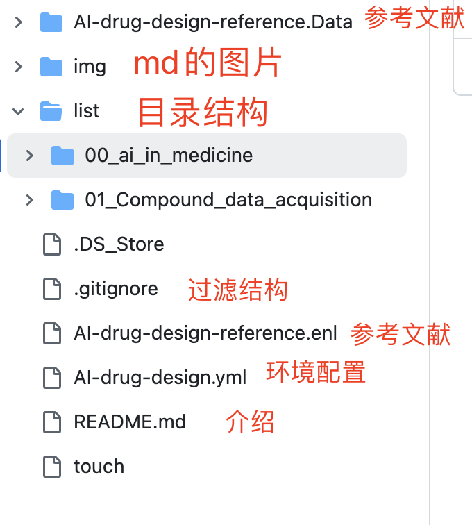
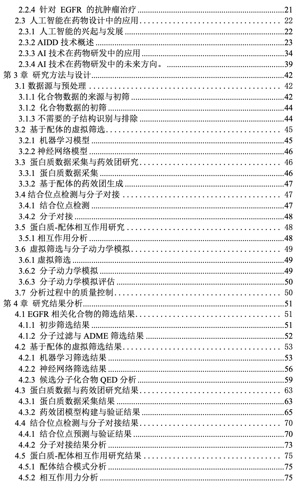

# AI-drug-design
我来简单的介绍一下吧，我这一块的是做什么的，我来用中文给大家讲解一下，方便大家语言能力不行的同学们，提供更好的支持，其实我应该是写英语的。但是为了方便 的大家能理解，能直接上手入门，我还是给大家提供中文吧！！

##  致谢 

- 首先我感谢我的中山大学的导师雷教授带我入门这一行，我踏入校园一无所知，所以也不知道自己的方向，一脸茫然的，所以还是特别感谢我的导师的。
- 第二个首先感谢，南京工业大学的计算化学大佬——“郭为涛”同学，一直帮助我，给我讲解制药的流程。
- 第三，我还是得感谢我的好朋友——南京医科大学的“周仪萍”同学，是她漂亮善良的姑娘，愿意帮助我。
- 其次，感谢我的群里面的大佬各路指导。
- 最后感谢社会人士和同道中人来帮我批评指正，让我的这一份文档，这一份代码写得更完整，更加完善，让我们祖国做的更好更强大，感谢祖国，感谢党。

## 前言

请您参考[https://www.mdpi.com/2075-1729/14/2/233]，这一篇论文[1]。我这里就不讲了。


好了，不说了，也不扯废话了，我们进入主题，接下来看看我们的目录是什么，我们要学习的知识是什么！！！


## 目录

- 01_化合物数据采集（ChEMBL）
- 02_分子过滤：ADME和先导化合物相似标准
- 03_分子过滤：不需要的子结构
- 04_基于配体的筛选：化合物相似性
- 05_复合聚类
- 06_最大公共子结构
- 07_基于配体的筛选：机器学习
- 08_蛋白质数据获取：蛋白质数据库（PDB）
- 09_基于配体的药效团
- 10_结合位点相似性和脱靶预测
- 11_查询在线API网络服务
- 12_从KLIFS获取数据
- 13_从 PubChem 获取数据
- 14_结合位点检测
- 15_蛋白质配体对接
- 16_蛋白质-配体相互作用
- 17_NGLview高级使用
- 18_先导化合物优化的自动化流程
- 19_分子动力学模拟
- 20_分析分子动力学模拟
- 21_One-Hot 编码
- 22_基于配体的筛选：神经网络
- 23_什么是激酶？
- 24_激酶相似性：序列
- 25_激酶相似性：激酶口袋（KiSSim 指纹）
- 26_激酶相似性：相互作用指纹
- 27_激酶相似性：配体概况
- 28_激酶相似性：比较不同的观点
- 29_分子表示
- 30_基于RNN的分子性质预测
- 31_基于GNN的分子性质预测
- 32_E(3)-不变图神经网络简介
- 33_不确定性估计
- 34_蛋白质配体相互作用预测


## 项目结构



## 配置代码环境


---------------------------------------------------⚠️如果你是大佬，直接看下面的这一步 beginning------------------------

### first 

❤️ u must need  read paper ⚠️:

Where r u ***AI-drug-design.yml*** ?

u first git clone my link!!!, it is have AI-drug-design.yml.

```bash
conda env create -f AI-drug-design.yml
```

如果你在国外或者有🪜，请您打开 AI-drug-design.yml

删除：

```bash
  - pytorch
  - https://mirrors.tuna.tsinghua.edu.cn/anaconda/pkgs/main
  - https://mirrors.tuna.tsinghua.edu.cn/anaconda/pkgs/free
```


### second

```bash
conda env list
```

 Check to see if the  ***AI-drug-design*** 

### Then  

```bash
conda activate AI-drug-design
```


---------------------------------------------------⚠️如果你是大佬，直接看下面的这一步 end------------------------


### ❤️如果你是小白的话，请您谦虚的看着下面的步骤：

### 一、Windows 和 macOS 系统上安装和配置 Git，并拉取我的代码到本地。

接下来，我将一步步为你讲解如何在 Windows 和 macOS 系统上安装和配置 Git，并拉取我的代码到本地。

### Windows 系统

#### 1. 下载并安装 Git

- 前往 [Git 官方下载页面](https://git-scm.com/)。
- 选择 Windows 版本进行下载，并按照提示完成安装。
  - 安装时，默认选项即可。如果想要自定义，可以根据需要选择不同的配置，比如编辑器、环境变量等。

#### 2. 配置 Git

安装完成后，打开终端（或 Git Bash）并配置你的 Git 用户信息：

```bash
git config --global user.name "Your Name"
git config --global user.email "youremail@example.com"
```

这样，Git 就会在你每次提交代码时使用这些信息来标识你的身份。

#### 3. 生成 SSH 密钥

在 Windows 上，打开 Git Bash，输入以下命令生成 SSH 密钥：

```bash
ssh-keygen -t rsa -b 4096 -C "youremail@example.com"
```

- 按回车后，你会看到提示选择存储密钥的位置，默认按回车即可。
- 然后你需要设置一个密码，可以为空，但建议设置。

#### 4. 添加 SSH 密钥到 GitHub

- 使用以下命令显示你生成的公钥：

```bash
cat ~/.ssh/id_rsa.pub
```

- 复制公钥并登录 GitHub。
- 前往 GitHub 的 [SSH 和 GPG 密钥页面](https://github.com/settings/keys)，点击 **New SSH key**。
- 将你刚才复制的公钥粘贴到文本框中，添加后保存。

#### 5. 克隆 GitHub 仓库

完成 SSH 密钥配置后，你可以使用以下命令克隆代码仓库：

```bash
git clone git@github.com:itWangCode/AI-drug-design.git
```

#### 6. 成功拉取代码

运行命令后，Git 会将代码拉取到本地的文件夹中。如果成功，你将看到类似如下的信息：

```bash
Cloning into 'AI-drug-design'...
```

这时，代码已经拉取成功。

---

### macOS 系统

#### 1. 安装 Git

macOS 上通常已经自带 Git，如果没有，可以通过 Homebrew 安装 Git：

- 打开终端，输入以下命令安装 Homebrew（如果没有安装）：

```bash
/bin/bash -c "$(curl -fsSL https://raw.githubusercontent.com/Homebrew/install/HEAD/install.sh)"
```

- 安装完成后，输入以下命令安装 Git：

```bash
brew install git
```

#### 2. 配置 Git

- 打开终端，输入以下命令配置 Git：

```bash
git config --global user.name "Your Name"
git config --global user.email "youremail@example.com"
```

#### 3. 生成 SSH 密钥

- 在终端中输入以下命令生成 SSH 密钥：

```bash
ssh-keygen -t rsa -b 4096 -C "youremail@example.com"
```

- 跟 Windows 一样，按回车使用默认路径存储密钥，设置密码（可选）。

#### 4. 添加 SSH 密钥到 GitHub

- 在终端中使用以下命令查看公钥：

```bash
cat ~/.ssh/id_rsa.pub
```

- 复制输出的公钥，登录 GitHub，将公钥添加到 [GitHub SSH Keys](https://github.com/settings/keys) 页面。

#### 5. 克隆 GitHub 仓库

使用以下命令克隆你的仓库到本地：

```bash
git clone git@github.com:itWangCode/AI-drug-design.git
```

#### 6. 成功拉取代码

Git 会将代码下载到当前目录，表示代码拉取成功。

这样，你就成功配置了 Git 并克隆了代码仓库。


### 二、如何在 Windows 和 macOS 系统上下载和安装 Anaconda-Navigator 并配置你的环境

#### 1. 下载 Anaconda-Navigator

##### Windows：
- 前往 [Anaconda 官方网站](https://www.anaconda.com/products/distribution)。
- 点击下载按钮，选择适合 Windows 系统的版本（通常为 64-bit）。
- 下载完成后，运行安装程序并按照提示完成安装。

##### macOS：
- 同样前往 [Anaconda 官方网站](https://www.anaconda.com/products/distribution)。
- 选择 macOS 系统的版本下载并安装。

安装过程中，建议勾选 "Add Anaconda to my PATH environment variable" 选项，以便在终端中可以直接使用 `conda` 命令。

#### 2. 打开 Anaconda-Navigator
安装完成后：
- 在 Windows 上，可以通过开始菜单找到 Anaconda-Navigator 并运行它。
- 在 macOS 上，可以在 "应用程序" 文件夹中找到 Anaconda-Navigator，点击启动。

#### 3. Git clone 你的仓库

在 Anaconda 环境中进行配置之前，首先需要将你的 GitHub 仓库克隆到本地。

1. 打开终端（macOS）或 Git Bash（Windows）。
2. 运行以下命令，克隆你的仓库：

```bash
git clone git@github.com:itWangCode/AI-drug-design.git
```

这将下载包含 `AI-drug-design.yml` 文件的仓库到本地。

#### 4. 创建 Conda 环境

进入克隆的项目文件夹，并通过 `.yml` 文件创建新的 Conda 环境：

1. 在终端或 Git Bash 中，切换到你克隆的仓库目录：

```bash
cd AI-drug-design
```

2. 运行以下命令，根据 `AI-drug-design.yml` 文件创建 Conda 环境：

```bash
conda env create -f AI-drug-design.yml
```

3. Conda 将自动根据 `.yml` 文件安装所需的依赖包并创建环境。

#### 5. 列出 Conda 环境

安装完成后，使用以下命令查看所有环境，检查是否创建了 `AI-drug-design` 环境：

```bash
conda env list
```

你应该会看到类似如下的输出，其中包含 `AI-drug-design`：

```bash
# conda environments:
#
base                  *  /path/to/anaconda3
AI-drug-design           /path/to/anaconda3/envs/AI-drug-design
```

#### 6. 激活环境

最后，使用以下命令激活 `AI-drug-design` 环境：

```bash
conda activate AI-drug-design
```

你现在已成功配置并激活了 `AI-drug-design` 环境，可以开始使用该环境进行开发了。

###  三、software

- https://www.jetbrains.com/pycharm/


####  Pycharm 2024.2.1 最新激活码，破解版安装教程（亲测至2099年~）

废话不多说，先上 Pycharm 2024.2.1 版本破解成功的截图，如下，可以看到已经成功破解到 2099 年辣，舒服！


###  卸载老版本 Pycharm

接下来，我就将通过图文的方式, 来详细讲解如何激活 Pycharm 2024.2.1 版本至 2099 年。首先，如果小伙伴的电脑上有安装老版本的 Pycharm , 需要将其卸载掉，如下所示（没有安装则不用管，直接安装即可）：


将**删除缓存和本地历史勾选上**，点击*卸载*按钮开始卸载：


卸载完成后，点击*关闭*按钮。

###  下载 Pycharm 安装包

访问 Pycharm 官网：https://www.jetbrains.com/pycharm/download，下载 Pycharm 2024.2.1 版本的安装包。


###  开始安装

下载完成后，双击 `.exe` 安装包开始安装 Pycharm :


点击*下一步*按钮：


**自定义安装路径**，我这里安装在了 `E:\` 盘下，继续点击*下一步*按钮：


进入到**安装选项**的选择，**将下图标注的部分，全部勾选上**，点击*下一步*按钮：


点击*安装*按钮，等待 Pycharm 安装完成：


安装成功后，会弹出如下提示框，一个是立即启动，不要勾选它。我们勾选 “*否，我会在之后重新启动*”，因为需要先破解成功后再启动 Pycharm :


点击*完成*按钮，关闭弹框。

###  下载破解脚本

破解脚本我放置在了网盘中，并提供了多个备用链接，以防下载失效。

> **提示：破解脚本的网盘链接文末获取 ~**
>
> **提示：破解脚本的网盘链接文末获取 ~**
>
> **提示：破解脚本的网盘链接文末获取 ~**

下载成功后，如下，是个压缩包，先对它进行解压：


###  开始激活

进入到解压后的文件夹 `/win2020-2024(一键激活)` 中，双击 *Pycharm 激活.vbs* ，若提示 `Success!!! Now you can enjoy Pycharm to 2099` , 则表示 Pycharm 激活成功啦 ~


###  检查是否激活成功

激活成功后，双击桌面的 Pycharm 快捷启动图标，来打开 Pycharm 。注意，首次安装 Pycharm 可能会弹出如下提示框，勾选 `Do not import settings`, 点击 *OK* 按钮即可：


进入 Pycharm 中后，点击菜单栏 *Help | Register...* , 即可查看 Pycharm 的激活到期时间：


如下图标注所示，根据日期显示直到 2099 年才会失效，确实是破解成功了：


###  激活脚本下载地址

> PS: 激活脚本由于**提取人数过多**，**导致分享的百度网盘链接容易被封**：蛋疼 ing，为限制人数，目前暂不提供页面直接下载，**改为从笔者公众号下载**。

> 需要的小伙伴，**扫描下方公众号二维码**，或者**关注公众号**： *Python 见习室*，**回复关键字**：*2099*, **即可免费无套路获取激活码、破解补丁，持续更新中 ~。**


更多的额操作：请您参考：【https://www.exception.site/article/1762】


## 文章所用到的 ***Python*** 语法

### Python 学习目录和教案 —— 适用于 AI-drug-design 项目

在学习 Python 用于 AI 药物设计（AI-drug-design）项目时，您需要掌握以下知识点。学习计划将涵盖基础知识、数据处理、机器学习、深度学习框架、药物设计相关库的使用等内容。以下是详细的学习目录和教案：

---

### 目录

1. **Python 基础**
    1.1 Python 环境配置（Anaconda、虚拟环境、Jupyter Notebook）
    1.2 Python 基础语法（变量、数据类型、运算符）
    1.3 控制结构（条件语句、循环）
    1.4 函数与模块（自定义函数、导入库）
    1.5 文件操作（读取和写入文件）
    1.6 异常处理

2. **数据处理与分析**
    2.1 Numpy 数组操作
    2.2 Pandas 数据框操作
    2.3 数据清洗与处理
    2.4 数据可视化（Matplotlib、Seaborn）
    2.5 基础统计与数据分析方法

3. **科学计算与机器学习基础**
    3.1 Scikit-learn 入门
    3.2 常用算法（线性回归、分类、聚类、决策树等）
    3.3 模型评估与优化
    3.4 模型调参与交叉验证

4. **深度学习框架**
    4.1 TensorFlow 基础
    4.2 Keras 快速上手
    4.3 PyTorch 基础
    4.4 GPU 加速与优化
    4.5 神经网络的构建与训练

5. **AI 药物设计基础**
    5.1 药物设计相关的 Python 库介绍
    5.2 RDKit（化学信息学工具）入门与使用
    5.3 Mol2Vec 分子特征表示方法
    5.4 化合物的预处理与分子特征提取
    5.5 分子对接与虚拟筛选
    5.6 药物活性预测模型

6. **高级主题**
    6.1 深度学习在药物设计中的应用
    6.2 分子生成模型（GAN、VAE）
    6.3 分子动力学模拟简介
    6.4 蛋白质结构预测与分子对接
    6.5 AI 在药物筛选和优化中的应用

---

### 教案

#### 1. Python 基础

**目标**：掌握 Python 基本语法、数据结构及控制流，能够编写简单的 Python 程序。

**教学内容**：
- Python 环境配置与解释器运行
- 基本数据类型（字符串、整数、浮点数、布尔）
- 数据结构：列表、字典、集合、元组
- 控制结构：if、else、for、while 循环
- 函数与参数传递，理解递归
- 模块的导入与创建（如 `math`、`random` 模块）

**作业**：
- 编写一个处理简单文本的 Python 程序（如计算文本单词频率）
- 编写一个函数，接受多个参数并返回最大值

#### 2. 数据处理与分析

**目标**：学习 Numpy 和 Pandas 库，能够进行高效的数据处理和分析。

**教学内容**：
- Numpy 基础：数组创建、形状修改、索引与切片、数组运算
- Pandas 基础：Series 和 DataFrame 的操作，缺失值处理，数据筛选与排序
- 数据的导入与导出（CSV、Excel 等格式）
- 数据可视化：柱状图、折线图、散点图
- 数据统计分析：均值、中位数、标准差等

**作业**：
- 使用 Pandas 读取 CSV 文件，计算每列的均值和标准差
- 使用 Matplotlib 绘制简单的柱状图和折线图

#### 3. 科学计算与机器学习基础

**目标**：掌握机器学习基础理论，能够使用 Scikit-learn 进行模型训练和评估。

**教学内容**：
- 监督学习和无监督学习简介
- 数据集的划分：训练集、验证集与测试集
- 线性回归、逻辑回归、KNN、决策树等基本算法
- 模型的评估：准确率、混淆矩阵、ROC 曲线
- 超参数优化与交叉验证

**作业**：
- 使用 Scikit-learn 进行一个简单的分类问题（如鸢尾花数据集分类）
- 绘制模型的 ROC 曲线并计算 AUC

#### 4. 深度学习框架

**目标**：熟悉常用的深度学习框架（TensorFlow、Keras、PyTorch），能够搭建简单的神经网络。

**教学内容**：
- TensorFlow 和 Keras 的基本用法：张量操作、模型构建
- PyTorch 的基本操作：Tensors、Autograd、优化器
- 构建简单的全连接神经网络
- 使用 GPU 进行模型训练
- 优化方法：SGD、Adam 等优化器
- 避免过拟合的正则化方法（如 Dropout）

**作业**：
- 使用 Keras 实现一个手写数字识别模型（MNIST 数据集）
- 使用 PyTorch 实现一个简单的卷积神经网络

#### 5. AI 药物设计基础

**目标**：学习 AI 药物设计相关的库，能够进行分子数据的处理与建模。

**教学内容**：
- RDKit 入门：分子结构的读取、绘制与操作
- 化合物分子描述符的计算
- 化学库的虚拟筛选
- Mol2Vec 特征表示方法
- 基于机器学习的药物活性预测模型
- 小分子的对接模拟（AutoDock、PyMOL 简介）

**作业**：
- 使用 RDKit 对一组化合物进行特征提取
- 使用机器学习模型预测药物活性

#### 6. 高级主题

**目标**：掌握深度学习在分子生成与药物设计中的应用。

**教学内容**：
- 分子生成模型：生成对抗网络（GAN）、变分自编码器（VAE）
- 基于深度学习的分子优化方法
- 蛋白质结构预测：AlphaFold 介绍
- 分子动力学模拟基础与应用
- 药物筛选流程与 AI 在其中的应用

**作业**：
- 使用 GAN 模型生成新的分子结构
- 编写脚本对某一蛋白质靶点进行分子对接模拟


## 来源的出处

- 跟我我的论文里面的内容，进行书写





## 进群讨论


## 能否支持我喝一杯咖啡，谢谢！！让我更有动力，写作！！！


## 参考文献

[1] Visan, A. I., & Negut, I. (2024). Integrating Artificial Intelligence for Drug Discovery in the Context of Revolutionizing Drug Delivery. *Life*, *14*(2), 233. https://www.mdpi.com/2075-1729/14/2/233 

